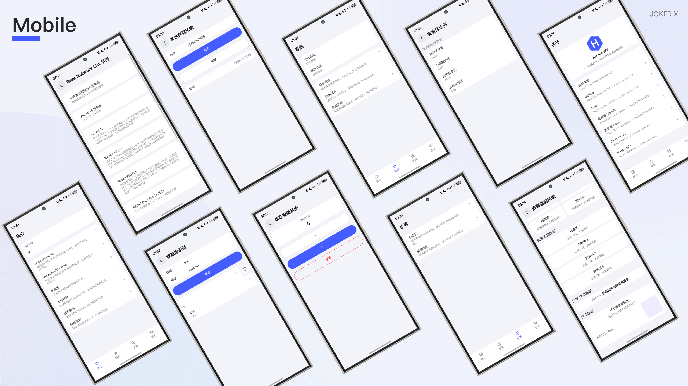
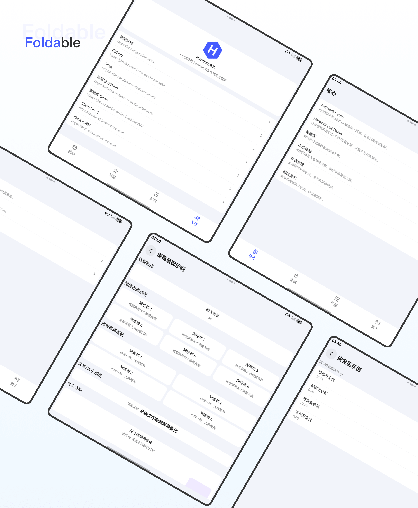
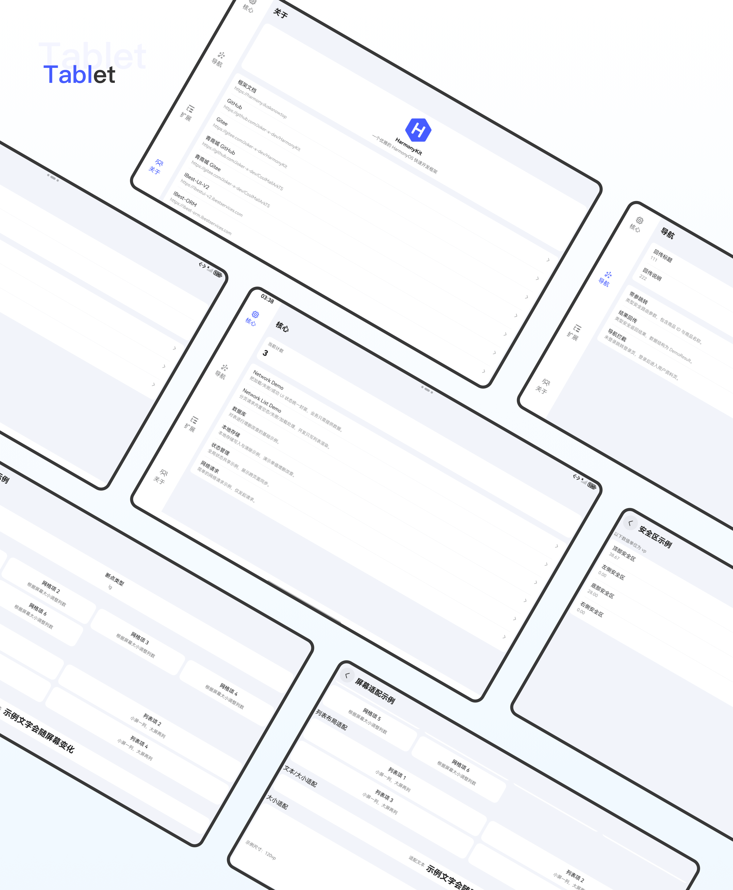

<div align="center">


# HarmonyKit

_一个开箱即用的 HarmonyOS 快速开发框架_

<!-- 语言切换按钮 -->
<div align="center">
  <a href="README_EN.md">🌍 English</a>
</div>

[](https://github.com/Joker-x-dev/HarmonyKit)
[](https://gitee.com/Joker-x-dev/HarmonyKit)
[](https://harmony.dusksnow.top)
[](https://deepwiki.com/Joker-x-dev/HarmonyKit)

</div>

## 📖 项目简介

HarmonyKit 是一个基于 **HarmonyOS NEXT / ArkTS / ArkUI** 的快速开发框架，内置应用最常见的基础能力（网络、分页、数据库、本地存储、状态管理、导航等），提供清晰的模块结构与示例页面，帮助你 **"拉仓库 → 运行 → 填业务"** 快速启动项目。

> 如果项目对你有帮助，欢迎点个 Star ⭐ 这会是持续维护的动力！

## 📱 项目预览







### 📍 项目地址

- **GitHub**：https://github.com/Joker-x-dev/HarmonyKit
- **Gitee**：https://gitee.com/Joker-x-dev/HarmonyKit

> 本框架源于 **青商城（HarmonyOS）** 的实践，仅保留通用能力与示例页面。完整电商业务请查看：
> GitHub：https://github.com/Joker-x-dev/CoolMallArkTS
> Gitee：https://gitee.com/Joker-x-dev/CoolMallArkTS

### 📚 说明文档

- **说明文档**：[在线查看](https://harmony.dusksnow.top)
  - 与代码同步的在线文档，包含快速开始、架构说明、示例路由、常见定制点等，便于理解项目与学习
- **IBest-UI-V2 组件库**：[在线查看](https://ibestui-v2.ibestservices.com)
  - 组件库使用说明与参数配置，包含常用组件示例
- **IBest-ORM 数据库文档**：[在线查看](https://ibest-orm.ibestservices.com)
  - 本地数据库能力与实体定义说明，包含基础使用示例
## 🧩 内置能力

- **基础网络**：统一网络封装 + 加载/错误/空态管理
- **分页列表**：统一分页逻辑 + 刷新/加载更多/空态
- **导航能力**：带参跳转、结果回传、路由拦截示例
- **数据库**：IBest-ORM CRUD 示例
- **本地存储**：账号/密码等轻量存储示例
- **状态管理**：V2（ObservedV2 / AppStorageV2 / PersistenceV2）示例
- **屏幕适配**：断点与安全区适配示例
- **设计系统**：统一空间/颜色/字体与通用组件

## 🛠️ 技术栈

| 类别 | 技术选型 | 说明 |
| --- | --- | --- |
| 编程语言 | ArkTS | HarmonyOS NEXT 主流语言 |
| UI 框架 | ArkUI | 声明式 UI 框架 |
| 架构模式 | MVVM | View + ViewModel 分离 |
| 导航框架 | Navigation | 路由与页面导航管理 |
| 状态管理 | V2 | ObservedV2 / AppStorageV2 |
| 组件库 | IBest-UI-V2 | 业务组件库与基础控件封装 |
| 网络请求 | Axios | HTTP 客户端与拦截器 |
| 数据库 | IBest-ORM | 本地数据库能力 |

## 📱 功能模块目录

- **主模块（main）**
  - 核心示例（core）
  - 导航示例（navigation）
  - 扩展示例（expand）
  - 关于页面（about）

- **认证模块（auth）**
  - 登录页（login）

- **用户模块（user）**
  - 用户资料（profile）

- **示例模块（demo）**
  - 基础网络请求示例（network-demo）
  - 分页列表示例（network-list-demo）
  - 数据库示例（database）
  - 本地存储示例（local-storage）
  - 状态管理示例（state-management）
  - 网络请求示例（network-request）
  - 带参跳转示例（navigation-with-args）
  - 结果回传示例（navigation-result）
  - 安全区适配示例（safe-area）
  - 屏幕适配示例（screen-adapt）

## 📁 项目结构

```
AppScope/               # 应用配置
entry/                  # 应用入口模块
core/                   # 核心模块
│   ├── base/           # 基类
│   ├── data/           # 数据层
│   ├── database/       # 数据库
│   ├── datastore/      # 数据存储
│   ├── designsystem/   # 设计系统
│   ├── ibestui/        # IBest UI 组件库
│   ├── model/          # 数据模型
│   ├── navigation/     # 导航
│   ├── network/        # 网络层
│   ├── result/         # 结果处理
│   ├── state/          # 全局状态
│   ├── ui/             # UI 组件
│   └── util/           # 工具类
feature/                # 功能模块
│   ├── auth/           # 认证模块
│   ├── demo/           # 示例模块
│   ├── main/           # 主模块
│   └── user/           # 用户模块
```

## 🚀 快速开始

1. 使用 DevEco Studio 打开项目并同步依赖  
2. 运行 entry 模块即可体验完整示例  
3. 参考各功能模块示例，快速开始业务开发

## 🤝 参与贡献

欢迎提交 PR 或 Issue，一起完善 HarmonyOS 快速开发体验。

## 👥 加入群聊

欢迎加入开发者交流群，一起交流学习与使用心得！

<div align="left">
  
  <p>扫码或搜索群号加入 QQ 群</p>
</div>
